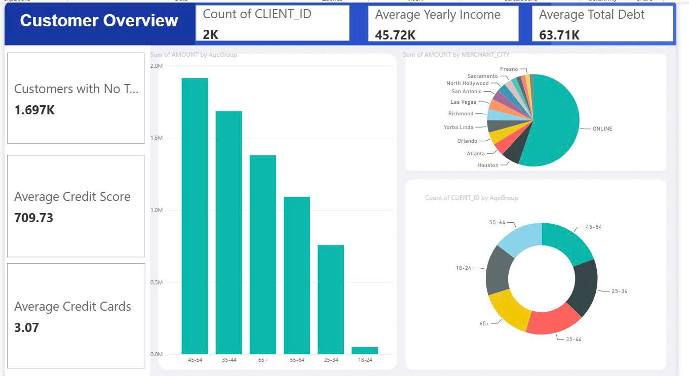
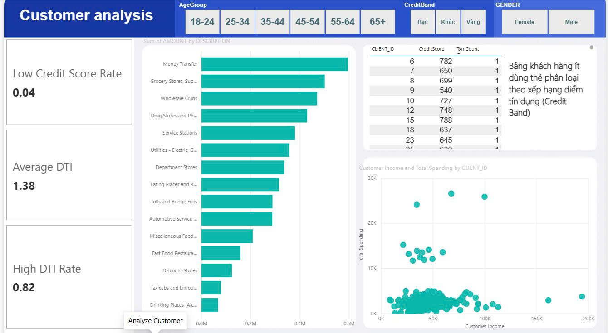

# Banking Customer Analytics Platform

An end-to-end data engineering project that ingests raw banking transaction data into Snowflake, transforms and models data using dbt, and delivers customer analytics dashboards through Power BI.

The project focuses on customer financial behavior, credit risk indicators, spending patterns, and demographic segmentation.

Raw CSV Files
      │
      ▼
 Snowflake (RAW)
      │
      ▼
 dbt Staging Models
      │
      ▼
 Star Schema Warehouse
      │
      ▼
  dbt Mart Models
      │
      ▼
 Power BI Dashboard
 
 ## Dataset

This project uses banking data stored in the `raw-data/` folder. The dataset contains card information, transaction data , merchant categories, cusomter informations and mcc codes.
## Data Warehouse Design

The warehouse follows a **Star Schema** design to support analytical reporting and business intelligence workloads.

### Fact Table
The warehouse follows a **Star Schema** design consisting of one fact table and five dimension tables:

- **FactTransaction**
- **DimCustomer**
- **DimCard**
- **DimMerchant**
- **DimMCC**
- **DimDate**
    
## Power BI Dashboard

### Customer Analysis

### Key Insights
* **Financial Profile & Credit Risk:**
  * The average Total Debt significantly exceeds the average Yearly Income. 
  * The average Debt-to-Income (DTI) ratio is quite high at 1.38, with 82% of the customer base classified under the high DTI rate.
  * Despite the heavy debt, the average credit score remains healthy at 709.73, and the low credit score rate is remarkably low at just 4%.

* **Spending Behavior & Channels:**
  * "ONLINE" transactions overwhelmingly dominate the total spending amount, far outperforming physical retail locations.
  * Card utilization is heavily concentrated in Money Transfers, Grocery Stores, and Wholesale Clubs, showing that customers primarily use their cards for essential needs and fund movements.

* **Demographics:**
  * The 45-54 age group contributes the highest transaction amount, followed by the 35-44 and 65+ segments. The youngest group (18-24) has the lowest spending footprint.

* **Customer Engagement Crisis:**
  *  Out of 2,000 total clients, 1697 are identified as having no transactions or very low card usage. This indicates a massive dormant user base that requires urgent re-engagement or activation campaigns.
